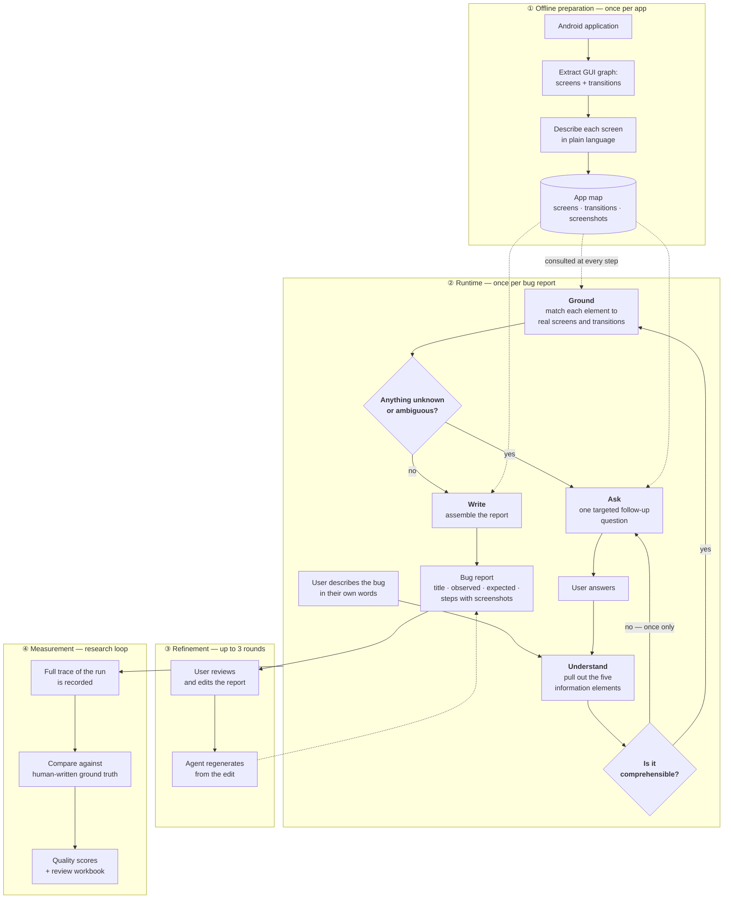
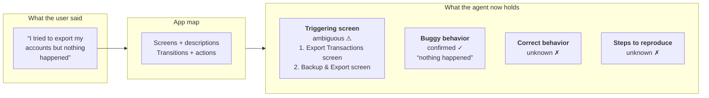
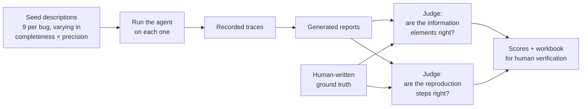
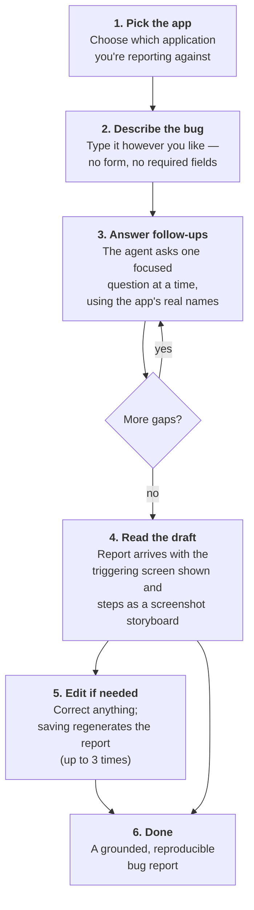

# BURT++ — Approach and Workflow

A high-level description of *what* BURT++ does and *how* it works, written for anyone who
wants to understand the approach without reading the code.

> **Related documents.** [ARCHITECTURE_OVERVIEW.md](ARCHITECTURE_OVERVIEW.md) is the
> technical companion to this file (components, APIs, data formats).
> [README.md](README.md) covers setup and commands.

---

## 1. The Problem

Most bug reports written by end users are unusable. Research on user-submitted Android bug
reports keeps finding the same three gaps:

* **What went wrong** is described vaguely — *"the app broke"*, *"it doesn't save"*.
* **What should have happened instead** is left out entirely, because it seems obvious to
  the person reporting it.
* **How to get there** — the reproduction steps — is either missing, out of order, or
  written in terms the developer cannot follow (*"I went to the settings thing"*).

A developer receiving such a report cannot reproduce the bug, so the report sits in a queue
until someone asks the reporter for more detail, which usually never arrives.

The obvious fix is to ask the reporter better questions. But a generic chatbot asking
*"can you tell me more?"* does not help either: it doesn't know what a good answer looks
like, it doesn't know when it has enough, and it can't tell whether *"the settings thing"*
refers to a real screen in the app.

**BURT++ closes that gap by giving the interviewer a map of the application.**

---

## 2. The Core Idea

BURT++ is a conversational agent that interviews a user about a bug **while holding a model
of the actual application in front of it**.

That model is a **GUI graph**: every screen the app can show, described in plain language,
and every transition between screens, labelled with the interaction that causes it. It is
extracted from the app ahead of time, once per bug under investigation.

Because the agent knows what screens exist and how they connect, it can do three things a
generic chatbot cannot:

| Capability | What it looks like in practice |
|---|---|
| **Ground vague language** | *"the settings thing"* is resolved to a specific screen in the app — or flagged as ambiguous between two candidates. |
| **Ask the question that matters** | Instead of *"tell me more"*, it asks *"Which screen were you on — the Account Settings screen or the Export Settings screen?"* |
| **Know when to stop** | It has an explicit checklist of what a complete report needs. It keeps asking until every item is resolved, then stops. |

The output is a bug report whose reproduction steps correspond to **real transitions in the
real app**, which also means each step can be illustrated with a screenshot of the actual
screen.

### Two ideas that make it work

**Information elements.** BURT++ does not try to write a report in one pass. It collects
five specific pieces of information, and nothing else:

| Information element | The question it answers |
|---|---|
| **Triggering screen reference** | Which app screen causes or shows the bug? |
| **Triggering GUI interactions** | Which interaction sets it off? |
| **Buggy behavior** | What actually happens? |
| **Correct behavior** | What should have happened instead? |
| **Steps to reproduce** | What sequence of actions leads there from app launch? |

**Confidence, tracked per element.** Each element is a *slot* that carries a status, and
that status is what drives the conversation:

| Status | Meaning | Consequence |
|---|---|---|
| `unknown` | The user hasn't said anything about it | Must ask |
| `ambiguous` | Two or three screens/actions could match what they said | Must ask, and the question offers the candidates |
| `inferred` | Confidently derived from what they said | Accept |
| `confirmed` | Explicitly stated and matched | Accept |

The interview ends when no slot is `unknown` or `ambiguous`. **"Is the report ready?" is a
mechanical check, not a judgment call** — which is what keeps the agent from either
stopping too early with a thin report or interrogating the user forever.

---

## 3. Process Flow

The end-to-end process has one **offline preparation** stage that runs once per application,
and a **runtime** stage that runs once per bug report.



The heart of it is the loop in stage ②: **understand → ground → check → ask → repeat**.
Every pass through that loop resolves a little more of the report, and the loop exits the
moment the checklist is complete.

---

## 4. The Stages, Described

### ① Offline preparation — building the app map

Before a single bug can be reported, the application is analysed and turned into a map the
agent can reason over. This happens once per app and is reused by every conversation.

**What goes in:** the application's GUI graph, captured by exercising the app — a dump of
its screens (with the UI elements on each) and the transitions between them.

**What happens:** the raw graph is cleaned up and simplified, then a language model writes a
short plain-language description of each screen from its UI elements — *"This setup wizard
screen shows the title 'Setup GnuCash' and a welcome page… the user can continue by pressing
NEXT."* Screenshots of every screen and every transition are kept alongside.

**What comes out:** a compact app map — the application name, the list of transitions, and a
readable description of every screen. This is the only thing the agent knows about the app,
and it's small enough to hand to the model on every call.

> **Why offline?** Parsing raw GUI graphs is slow and doesn't change between conversations.
> Doing it ahead of time keeps the interview responsive.

### ② Runtime — the interview

**Start.** The user picks which application/bug they're reporting against and describes the
problem in their own words. No form, no required fields.

**Understand.** The agent reads the description and pulls out whichever of the five
information elements are present, keeping the user's own wording and recording the exact
phrases that support each one. Anything the user didn't mention is simply left empty — the
agent does not invent it.

**Comprehension check.** Before trying to match anything against the app, the agent asks
itself whether the description is even intelligible. If it genuinely isn't, it asks one
clarifying question — and only one. This step exists to rescue incoherent input, not to
interrogate; a merely *incomplete* description proceeds straight to grounding, because
incompleteness is what the main loop is for.

**Ground.** This is the distinctive step. Each extracted element is matched against the app
map:



*(Illustrative example.)* Notice what grounding produces: not just an interpretation, but an
interpretation **with a confidence label and, where uncertain, ranked alternatives backed by
evidence**. Vague input doesn't get silently guessed at — it gets marked `ambiguous` and
carries its candidates forward.

**Check.** The agent scans the five slots and collects everything still `unknown` or
`ambiguous`. If the list is empty, it writes the report.

**Ask.** Otherwise it composes exactly one follow-up question, targeted at the highest-value
gaps — missing information is prioritised over ambiguous information — and phrased using the
app's real vocabulary. Because the agent knows the candidate screens, it can offer them
rather than asking open-endedly. The conversation pauses here until the user replies, then
the reply goes back through *understand → ground → check*, and the mapping is updated in
place. Each round narrows the gap.

**Write.** Once everything is resolved, the agent assembles the report:

* **Title** — a one-line summary
* **Observed behavior** — what happened, on which screen, after which interaction
* **Expected behavior** — what should have happened
* **Steps to reproduce** — an ordered path from app launch to the bug, each step
  corresponding to a real transition in the app map

Because each step is tied to a transition, and each transition has a captured screenshot,
the report can be shown as a **visual storyboard**: the triggering screen displayed next to
the behavior description, and the reproduction steps laid out as a filmstrip of the actual
screens the user would pass through.

### ③ Refinement — the user has the last word

The generated report is a draft, not a verdict. The user can edit any part of it and save.

Saving does something more interesting than storing the text: the edited report is **fed
back to the agent as a fresh description of the bug**, and the agent regenerates from it.
The user's corrections therefore propagate through grounding and rewriting rather than
sitting as an unreviewed patch on top of a generated document.

This regeneration is deliberately **single-pass** — it asks no follow-up questions. The user
has already said what they wanted changed; asking them again would be tedious. Up to three
edit-and-regenerate rounds are allowed per report, and every version is kept:

```
Draft 1  →  Final 1 (your edit)  →  Draft 2  →  Final 2  →  Draft 3  →  …
```

Nothing is overwritten. The full history stays visible, so you can see how the report
evolved and compare versions.

### ④ Measurement — how the approach is evaluated

BURT++ is a research tool as much as a product, so every run is measurable.

Each conversation is recorded in full: every turn, every step the agent took, what it
produced, how long it took, and how many tokens it consumed. These traces are the input to
an automated evaluation pipeline.



**Seed descriptions.** Each bug in the dataset comes with nine human-written starting
descriptions arranged on a grid: three levels of **completeness** × three levels of
**precision**. This tests the agent against the vague reporter *and* the meticulous one, and
reveals how much of the final quality comes from the agent versus from the input.

**Two judges.** A language model compares the generated report against the human ground
truth on two axes — whether each information element is *correct, incomplete, ambiguous,
missing, or incorrect*, and whether each generated reproduction step matches a real
ground-truth step or is spurious.

**Human verification.** The judges' labels are not taken as final. They are written into a
review workbook where a researcher confirms or overrides each one, and precision, recall,
and F1 recompute live from the **human** column. The automation drafts the grading; a person
signs it off.

---

## 5. The User's Workflow

What the process feels like from the reporting side:



Practical notes on the experience:

* **One question at a time.** The agent never presents a form or a wall of questions. Each
  turn asks for exactly what it's missing.
* **Questions in the app's own language.** *"Was this on the Transaction Detail screen or the
  Account Overview screen?"* — not *"which screen?"*.
* **The conversation survives.** Sessions are checkpointed, so closing the tab and coming
  back doesn't lose the interview. Each application keeps its own separate conversation.
* **Reports come with pictures.** The triggering screen appears beside the behavior text, and
  the reproduction steps are laid out as a storyboard of the real screens.
* **Nothing is thrown away.** Every draft and every edit stays in the history.

---

## 6. Design Principles

The choices behind the approach, and the reasoning:

**Ground everything in the real application.** The single decision that separates BURT++
from a scripted questionnaire. It's what allows targeted questions, real reproduction steps,
and screenshot evidence — all three fall out of the same app map.

**Track confidence explicitly, per element.** Making uncertainty a first-class value rather
than a hidden judgment is what makes the interview terminate predictably. It also means
ambiguity is *surfaced to the user as a choice* instead of being resolved by a coin flip.

**Never invent.** If the user didn't say it, the slot stays `unknown` and the agent asks.
The report contains what was established, not what was plausible.

**Ask sparingly.** Comprehension clarification is capped at a single round. Completeness
questions target the highest-value gap first. The goal is the fewest turns that produce a
complete report — every extra question is a chance for the user to abandon the process.

**The user has the final say, but corrections re-enter the pipeline.** Edits are treated as
new information about the bug rather than as manual patches, so a correction to one field
can improve the rest of the report.

**Separate what changes from what doesn't.** The app map is built once and reused. The
prompts that drive each step are versioned separately from the code, so changing how the
agent reasons doesn't require changing the system — and every version's runs and scores stay
partitioned for comparison.

**Make every run measurable.** The traces the agent writes during normal operation are
exactly what the evaluation pipeline consumes. There is no separate "evaluation mode" — any
conversation, interactive or batch, can be scored after the fact.

---

## 7. Scope and Limits

Worth being clear about what the approach assumes:

* **An app map must exist.** BURT++ can only report on applications whose GUI graph has been
  extracted and prepared. It cannot be pointed at an arbitrary app.
* **The map bounds what can be grounded.** A bug on a screen the graph never captured, or
  triggered by an interaction outside the recorded transitions, cannot be grounded — the
  agent will ask about it but has nothing to match it against.
* **The map is a snapshot.** If the application changes, the map has to be rebuilt or the
  grounding will refer to screens that no longer exist.
* **The reporter has to engage.** The approach trades a few rounds of questions for report
  quality. A user who abandons the conversation mid-interview leaves nothing behind.
* **Not a bug finder.** BURT++ documents a bug the user has already encountered; it does not
  detect, diagnose, or localise faults.
