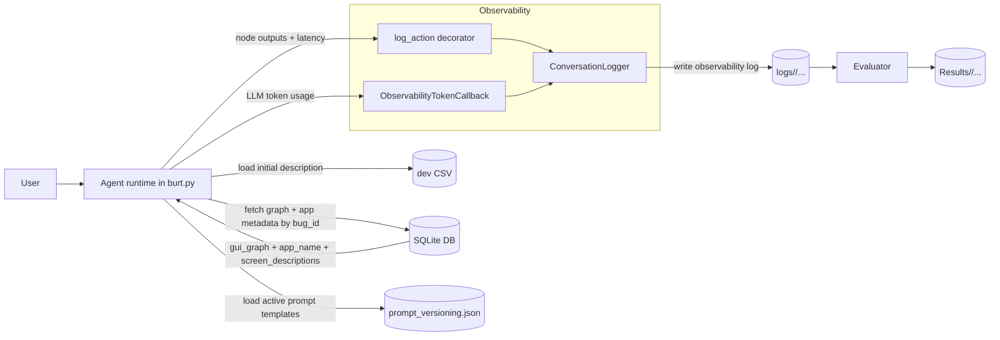
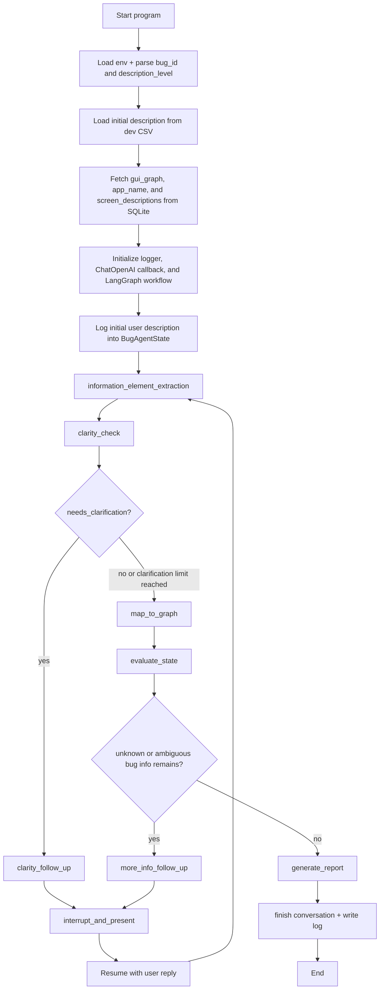

# Architecture

## 1. System Design

### Deeper on Logging
- Per-action logging is handled by `@log_action` in `observability.py`, which wraps instrumented runtime functions, measures latency, and records their outputs.
- `ObservabilityTokenCallback` attaches to the active `ChatOpenAI` model and captures provider token usage for both action-level and conversation-level summaries.
- `ConversationLogger.start_conversation()` and `ConversationLogger.finish_conversation()` record conversation-wide timing and build the final `conversation_summary` record.
- Logs are written as back-to-back JSON records: one record per conversation turn, followed by a final `conversation_summary` record.
- Each turn contains an `actions` list with entries such as `user_description`, `information_element_extraction`, `clarity_check`, `extract_and_update`, `follow_up`, and `generate_report`.
- Log paths are versioned by `config.PROMPT_VERSION`, so runtime logs and evaluation outputs can be grouped by active prompt version.

## 2. Agent Control Flow

- The runtime is a LangGraph state machine compiled in `burt.py` with `MemorySaver` checkpointing so the graph can pause at interrupts and resume after the user answers.
- The first user message is not typed interactively; it is loaded from the description CSV column matching the requested `description_level`.
- `information_element_extraction` operates in one of three modes: initial description, clarity follow-up, or more-info follow-up.
- `clarity_check` can request one clarification round before the graph continues to mapping.
- `map_to_graph` grounds extracted natural-language information elements into the structured `BugInfo` mapping using the application graph and screen descriptions.
- `evaluate_state` checks for unresolved slots. If any remain, `more_info_follow_up` generates the next user-facing question and the graph interrupts.
- Final report generation happens after the graph loop ends. `gen_report()` refuses to run if unresolved bug-info slots still remain.

## 3. File Responsibilities

- `burt.py`: Main runtime entrypoint. Loads inputs, fetches database context, builds the LangGraph workflow, manages CLI interrupts, generates the final report, and writes the observability log.
- `graph_utils.py`: Prompt-loading and LLM orchestration utilities for extraction, clarity checks, graph mapping, follow-up generation, bug-info formatting, and final report synthesis.
- `prompt_versioning/prompt_versioning.json`: Source of truth for prompt-version records. Each record contains an `agent-version-title` plus a `prompts` mapping used by the runtime.
- `prompt_versioning/prompt_versioning_json.py`: Helper utilities for reading and programmatically updating prompt-version records.
- `state.py`: Pydantic models for `BugAgentState`, follow-up tracking, extracted information elements, and the structured `BugInfo` slot mapping.
- `llm_schema.py`: Structured-output schemas used by runtime LLM calls for extraction, follow-up generation, clarity decisions, mapping updates, and report generation.
- `observability.py`: Logging models, action instrumentation, token-usage callback capture, conversation summary generation, and log-file serialization.
- `config.py`: Runtime configuration constants such as `MODEL_NAME`, `PROMPT_VERSION`, `DATABASE_URL`, and the description CSV path.
- `database/db.py`: SQLAlchemy engine/session setup wired to `config.DATABASE_URL`.
- `database/models.py`: SQLAlchemy ORM schema. The active runtime model is the `bug` table with `bug_id`, `application_name`, `gui_graph`, and `screen_descriptions`.
- `database/database_utils.py`: Query helpers used by the runtime to fetch graph data and app metadata by `bug_id`.
- `database/load_data.py`: Manual utility for loading selected graph files into the `bug` table and generating `screen_descriptions`.
- `database/graph_data_parser.py`: Graph parsing helpers for locating raw graph files, simplifying IDs, filtering graph text, and preparing transition/screen descriptions.
- `run_all_burt.py`: Batch runner that discovers runnable `(bug_id, description_level)` pairs from the CSV, executes `burt.py` for each one, and then runs the evaluator on the resulting log directory.
- `evaluator/runner.py`: Evaluation entrypoint. Reads logs, derives evaluation context, runs the judge passes, writes `*.evaluation.json`, and rebuilds the manual-review workbook.
- `evaluator/parsing.py`: Parsing helpers for discovering log files, extracting metadata from log paths, decoding JSON records, and joining ground-truth CSV rows.
- `evaluator/judges.py`: Evaluator-local LLM helpers for extracting information elements from the final generated report and grading info elements and steps to reproduce.
- `evaluator/generate_review.py`: Workbook builder for `manual_review.xlsx`, including the `S2R Review`, `Info Elements Review`, and `Summary` sheets.
- `logs/<PROMPT_VERSION>/`: Runtime observability logs grouped by active prompt version.
- `Results/<agent_version>/`: Evaluator outputs grouped by log directory / prompt version, including `*.evaluation.json` and `manual_review.xlsx`.
- `tests/`: Automated test suite, currently written with `unittest`, covering evaluator behavior, review generation, observability, state handling, batch running, and related utilities.

## 4. Core Dependencies

- SQLAlchemy (`2.0.46`): ORM and DB toolkit for the SQLite-backed bug metadata store and Alembic-backed schema management. Docs: <https://docs.sqlalchemy.org/>
- Alembic (`1.18.3`): Schema migration tool for the SQLite database used by the runtime loader and app-graph store. Docs: <https://alembic.sqlalchemy.org/>
- LangChain Core (`1.2.7`) + LangChain OpenAI (`1.1.7`): Prompt/message abstractions, structured output helpers, and OpenAI chat-model integration. Docs: <https://python.langchain.com/docs/introduction/>
- LangGraph (`1.0.6`): Graph-based runtime orchestration, interrupts, resume commands, and checkpointed state for the agent control flow. Docs: <https://langchain-ai.github.io/langgraph/>
- Pydantic (`2.12.5`): Typed data models and validation for agent state, structured outputs, evaluator schemas, and observability payloads. Docs: <https://docs.pydantic.dev/latest/>
- OpenPyXL (`3.1.5`): Workbook generation for the manual-review artifacts produced by the evaluator. Docs: <https://openpyxl.readthedocs.io/>
