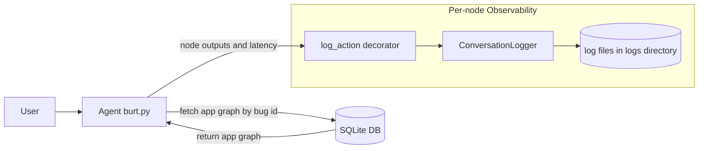
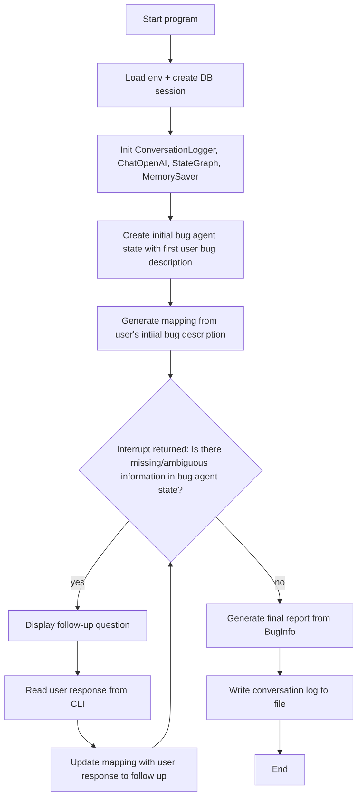

# Architecture

## 1. System Design

### Deeper on Logging
- Per-node logging is handled by `@log_action` in `observability.py`, which wraps each node execution, measures latency, and records the node output.
- When a new `user_description` is logged, the logger advances to a new conversation turn.

## 2. Agent Control Flow

## 3. File Responsibilities

- `burt.py`: Main runtime entrypoint. Builds and runs the LangGraph workflow, orchestrates user interaction loop, and triggers final report generation plus log writing.
- `graph_utils.py`: Prompt and LLM orchestration utilities for extraction, follow-up generation, bug-info postprocessing, and final report synthesis.
- `state.py`: Pydantic models for agent state (`BugAgentState`), tracked bug information (`InfoSlots`/`Slot`), and confidence/status types.
- `llm_schema.py`: Structured-output schemas for LLM calls (extraction, follow-up question, report sections).
- `observability.py`: Logging domain models and decorator-based per-action instrumentation, including latency and turn-based conversation logging.
- `config.py`: Central constants such as model and DB uri.
- `requirements.txt`: Pinned Python dependencies for runtime and development.
- `database/db.py`: SQLAlchemy engine/session setup and SQLite foreign-key pragma configuration.
- `database/models.py`: SQLAlchemy ORM schema for `Bug`, `Screen`, and `Transition` tables.
- `database/database_utils.py`: DB query helper(s), currently `fetch_app_graph` by `bug_id`.
- `database/load_data.py`: One-off loader script to ingest graph text data into the `bug` table.
- `logs/*.log`: Generated conversation traces written by `ConversationLogger` for each bug/session run.

## 4. Core Dependencies

- SQLAlchemy (`2.0.46`): ORM and DB toolkit for SQLite schema/session/querying. Docs: <https://docs.sqlalchemy.org/>
- LangChain Core (`1.2.7`) + LangChain OpenAI (`1.1.7`): Prompting/message abstractions and OpenAI chat model integration. Docs: <https://python.langchain.com/docs/introduction/>
- LangGraph (`1.0.6`): Graph-based control flow, interrupts, commands, and checkpointed state for the agent lifecycle. Docs: <https://langchain-ai.github.io/langgraph/>
- Pydantic (`2.12.5`): Typed data models and validation for state, logging payloads, and structured model output schemas. Docs: <https://docs.pydantic.dev/latest/>
