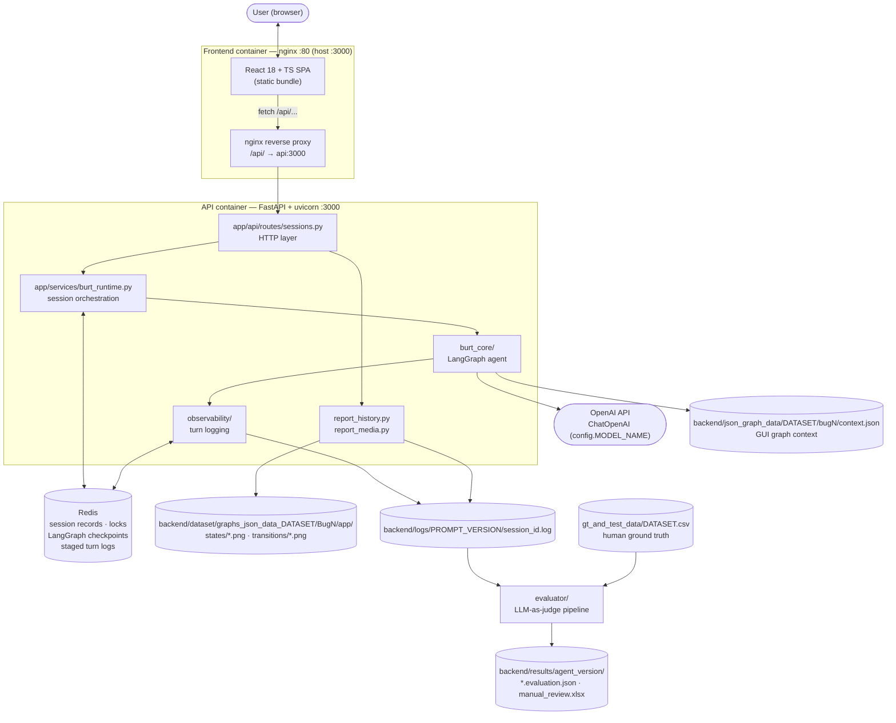
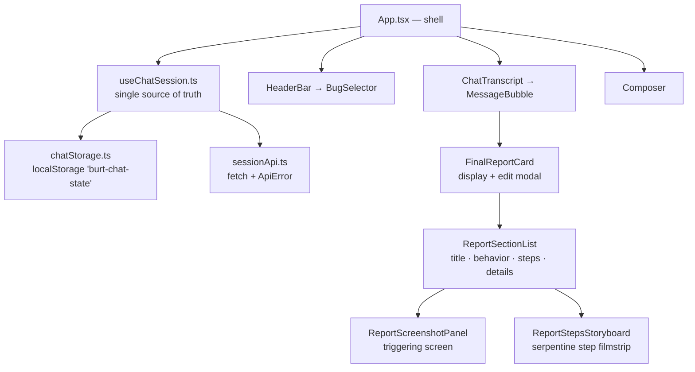
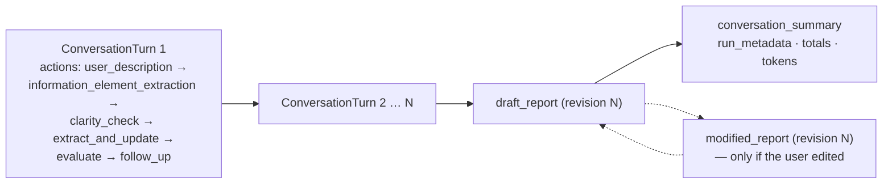
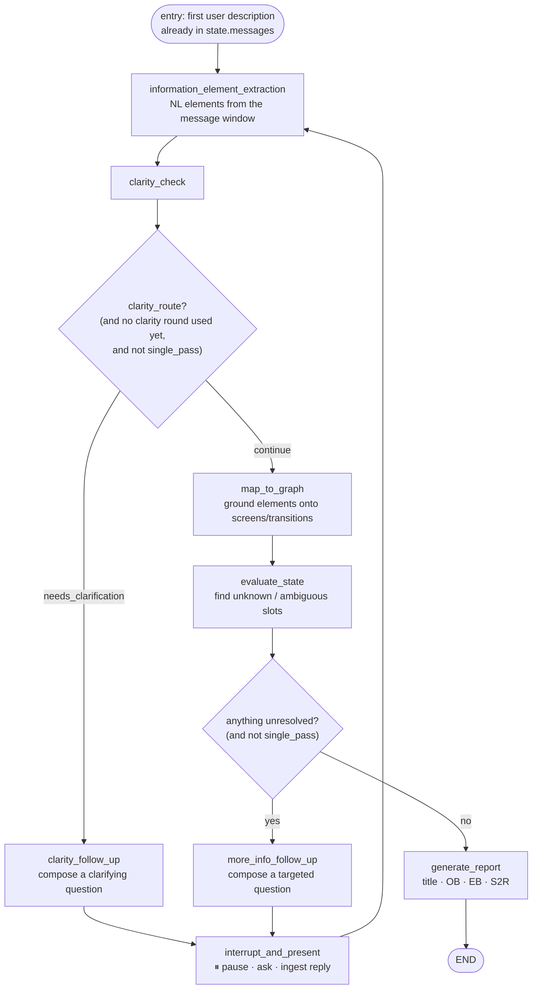
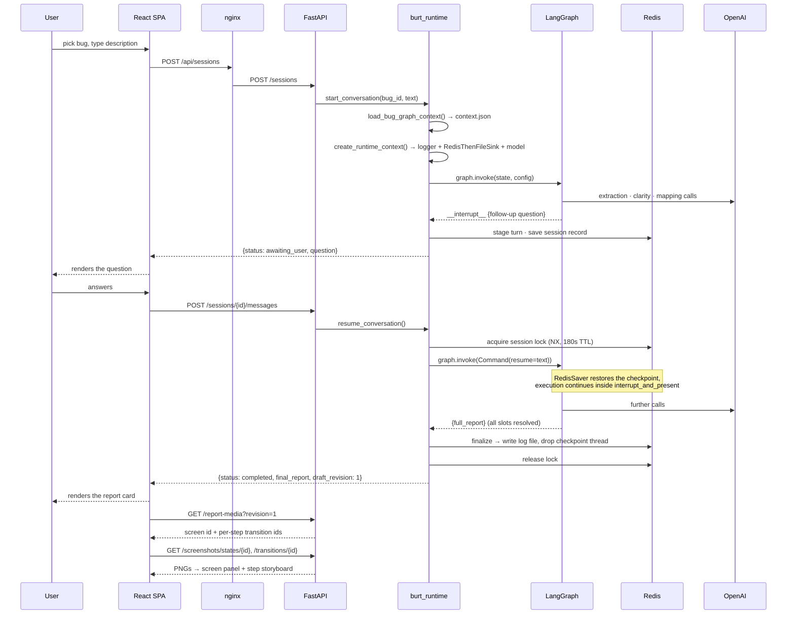
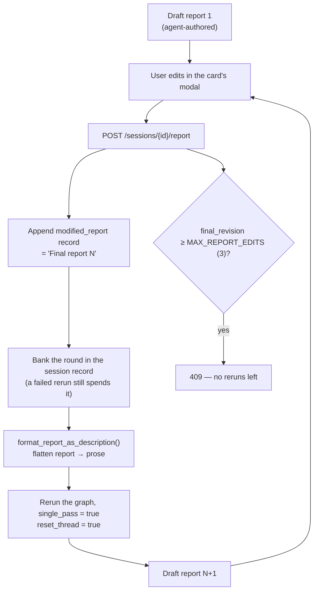
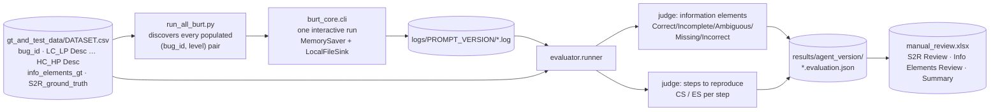

# Agentic BURT — Architecture & Workflow

A complete, reader-friendly map of the BURT++ system: what each component is, what goes
in, what comes out, and how a bug report is produced end to end.

> This document covers the **whole** system (web stack + agent + observability +
> evaluation). The older [ARCHITECTURE.md](ARCHITECTURE.md) is scoped to the local CLI
> path only and is superseded by this file.

---

## 1. What The Tool Does

BURT++ is a **conversational bug-reporting agent for Android apps**. A user describes a
bug in plain language; the agent interviews them with targeted follow-up questions,
**grounds** every claim against a pre-extracted **GUI graph** of the real application
(screens and transitions), and then writes a structured bug report with reproduction
steps that point at actual app transitions — with screenshots attached as evidence.

Three things make it more than a chat wrapper:

| Idea | What it means in the code |
|---|---|
| **Grounding** | Free-text user statements are mapped onto real screen / transition IDs from the app's GUI graph (`map_to_graph`). |
| **Slot confidence** | Every piece of information is a `Slot` with a status (`unknown` / `ambiguous` / `inferred` / `confirmed`). The agent only stops asking questions when nothing is unresolved. |
| **Measurable** | Every run writes a structured observability log, and an LLM-as-judge evaluator scores those logs against human ground truth. |

The system has **two front doors** onto the same agent core:

* **Interactive web app** — React SPA → nginx → FastAPI → LangGraph agent, with Redis for
  session state and checkpointing. This is the product.
* **Offline CLI / batch** — runs the same graph over a dataset CSV, then evaluates the
  resulting logs. This is the research harness.

---

## 2. System Landscape



**Deployment note:** the API is *not* published on the host. Only nginx is
(`localhost:3000`), and it forwards `/api/...` to `api:3000` on the Compose network with a
300 s read timeout — long agent turns are expected and tolerated.

---

## 3. Component Catalog

### 3.1 Frontend (`frontend/`)

React 18 + TypeScript, built by Vite, served as a static SPA by nginx. No router, no state
library, no CSS framework — one hook holds all state and one stylesheet does all styling.



| Component | Input | Output |
|---|---|---|
| `App.tsx` | — | Renders `HeaderBar` / `ChatTranscript` / `Composer`; computes composer-disabled state |
| `useChatSession.ts` | User draft text, bug selection, API responses | `ConversationSnapshot` per bug (`sessionId`, `status`, `messages`, `editsRemaining`), submit handlers |
| `chatStorage.ts` | `PersistedAppState` | Reads/writes `localStorage` so a reload keeps the transcript (one conversation per bug id) |
| `sessionApi.ts` | Typed request DTOs | Typed response DTOs; throws `ApiError(status, detail)` |
| `BugSelector` | `availableBugIds`, discovery status | `onChange(bugId)` — switching bugs resets that conversation |
| `ChatTranscript` / `MessageBubble` | `ChatMessage[]` (`agent \| user \| thinking \| final_report \| error`) | Rendered transcript; only the **newest draft** report keeps its Edit button |
| `FinalReportCard` | `report`, `sessionId`, `revision`, `variant` | Sectioned report, raw-JSON disclosure, edit modal; fetches `/report-media` for screenshots |
| `reportSteps.ts` | Raw step lines | Strips the trailing `<graph-id>` marker for display, pairs steps with transition screenshots, computes the boustrophedon storyboard grid |

**Key UI behaviors**

* A `thinking` bubble is pushed on submit and replaced in place when the response lands.
* On reload, a completed session calls `GET /sessions/{id}/reports` and splices the
  server's authoritative report history into the locally stored transcript.
* The composer locks once a session is `completed` — further changes go through the
  **edit-and-regenerate** path instead.

### 3.2 API Layer (`backend/app/`)

| File | Responsibility | Input | Output |
|---|---|---|---|
| `main.py` | FastAPI app, mounts the router | — | ASGI app |
| `api/routes/sessions.py` | HTTP surface; maps service exceptions to status codes | JSON request bodies, path/query params | Pydantic response models, `FileResponse` for PNGs |
| `schemas/sessions.py` | Request/response contracts | — | `ConversationTurnResponse`, `SessionReportsResponse`, `ReportMediaResponse`, … |
| `services/burt_runtime.py` | Session orchestration: build runtime context, invoke/resume the graph, persist outcome, enforce edit limit | `bug_id`, user text or edited report | `ConversationTurnResponse` |
| `services/session_store.py` | Redis session records + per-session resume lock (token-owned, 180 s TTL, Lua-guarded release) | `session_id`, record dict | Record dict / lock token / bool |
| `services/report_history.py` | Replays every report a session wrote to its log | `session_id` | Ordered list of `{kind, revision, label, report}` + edit budget |
| `services/report_media.py` | Resolves which report fields have a GUI-graph screenshot | `session_id`, optional `revision` | Screen id, per-step transition ids, `has_screenshot` flags; resolves PNG paths |

**HTTP endpoints**

| Method & path | Input | Output |
|---|---|---|
| `GET /healthz` | — | `{status, redis}` |
| `GET /bugs/active` | — | `{bug_ids}` — bugs whose `context.json` loads |
| `POST /sessions` | `{bug_id, user_description}` | Turn response: a **question** or a **completed report** |
| `GET /sessions/{id}` | — | Last persisted turn response (crash/reload recovery) |
| `POST /sessions/{id}/messages` | `{user_description}` | Next question, or the completed report |
| `POST /sessions/{id}/report` | `{modified_report}` | Logs the edit, reruns BURT++ single-pass, returns the **regenerated draft** |
| `GET /sessions/{id}/reports` | — | Full alternating draft/final report history |
| `GET /sessions/{id}/report-media?revision=N` | — | Screenshot availability for that revision |
| `GET /sessions/{id}/screenshots/{kind}/{image_id}` | `kind ∈ {states, transitions}` | `image/png` |

### 3.3 Agent Core (`backend/burt_core/`)

| File | Responsibility | Input | Output |
|---|---|---|---|
| `burt.py` | Defines the LangGraph nodes and compiles the state machine; creates the per-request `BurtRuntimeContext` (logger + sink + token callback + model) | `BugAgentState`, `RunnableConfig` (transitions, app_name, screen_descriptions, thread_id, runtime_context) | Compiled graph; per-node state updates |
| `state.py` | `BugAgentState`, `InfoSlots`, `Slot`, `SlotStatus`, `ActiveFollowUp` — the agent's memory | — | Validated Pydantic state |
| `llm_schema.py` | Structured-output schemas for every LLM call | — | `ExtractionSchema`, `ClaritySchema`, `ClarityFollowUpSchema`, `MoreInfoFollowUpSchema`, `ReportGenerationSchema` |
| `agent_utils.py` | Prompt loading + every LLM call + slot formatting/validation helpers | State fragments, GUI graph text, prompt version | Structured LLM results, prompt-ready text blocks, unresolved-slot sets |
| `cli.py` | Local interactive entrypoint | `--bug-id`, `--description-level` | Terminal Q&A, printed report, local log file |

**The state the agent carries** (`BugAgentState`):

```
messages[]                        conversation history (LangChain messages)
BugInfo: InfoSlots                the grounded mapping — the real deliverable
  ├─ triggering_screen_reference : Slot
  ├─ triggering_GUI_interactions : Slot[]
  ├─ buggy_behavior              : Slot
  ├─ correct_behavior            : Slot
  └─ steps_to_reproduce          : Slot[]
information_element_extraction    transient natural-language extraction
clarity_route / clarity_issues    clarity-check verdict
clarification_rounds              capped at 1
unknown_and_low_confidence_info   set of unresolved slot references
active_follow_up                  the question currently on the table
single_pass                       true for edit-driven regeneration
full_report                       terminal output
```

A `Slot` is validated by status: `unknown` → 0 candidates, `inferred`/`confirmed` → exactly
1, `ambiguous` → 2–3 ranked candidates (index 0 = strongest). This invariant is what makes
"is the report done yet?" a mechanical check rather than a judgment call.

### 3.4 GUI Graph Context (`backend/gui_graph_context_management/`)

| File | Responsibility | Input | Output |
|---|---|---|---|
| `graph_data_parser.py` | Parses raw GUI-graph dumps: locates graph files, simplifies/restores screen & transition ids, filters graph text, extracts transitions and per-screen UI info | `backend/dataset/graphs_json_data_<DATASET>/Bug<id>/<app>/*-graph.txt` | Transition lines, screen-info blocks, id maps |
| `generate_screen_descriptions.py` | LLM pass that turns raw UI element dumps into readable screen descriptions | Raw graph text + model | `"<screen_id> - <ScreenName>: <description>"` lines |
| `build_context.py` | Offline builder that assembles and writes the runtime payload | Raw graph dumps + `SELECTED_DATA` bug→app map | `json_graph_data/<DATASET>/bug<id>/context.json` |
| `loader.py` | Runtime reader | `bug_id` | `(transitions, application_name, screen_names_and_descriptions)`; also `list_active_bug_ids()` |

`context.json` shape:

```json
{
  "application_name": "GNU",
  "transitions": ["1818118628: (s:-1659243725,t:-1580807008): [... act=(6) open app ...]", "..."],
  "screen_names_and_descriptions": ["-1580807008 - FirstRunWizardActivity: This setup wizard screen ...", "..."]
}
```

This is the agent's entire model of the application. It is built **offline, once per bug**
— nothing in the request path parses raw graphs.

### 3.5 Observability (`backend/observability/`)

| File | Responsibility | Input | Output |
|---|---|---|---|
| `observability_models.py` | Record schemas: `Action`, `ConversationTurn`, `LLMUsageEvent`, `TokenConsumptionSummary`, `DraftReportRecord`, `ModifiedReportRecord`, `ConversationSummaryRecord` | — | Validated records |
| `logging_runtime.py` | `@log_action` decorator (wraps a node, times it, captures its output), `TurnLogger` (owns the in-flight turn), `ObservabilityTokenCallback` (LangChain callback harvesting provider token usage) | Node invocations, LLM responses | In-memory turn records with per-action latency + tokens |
| `observability_sinks.py` | Persistence: `LocalFileSink` (append to file) and `RedisThenFileSink` (stage turns in Redis, flush to file at completion); `finalize_session` rebuilds totals and appends terminal records | Turn records, final report, run metadata | Log file of back-to-back JSON records |

**Separation of concerns:** `TurnLogger` owns the turn *lifecycle*; the sink owns
*persistence*. Swapping storage backends never touches the agent.

**Log file anatomy** (`logs/<PROMPT_VERSION>/<session_id>.log`, concatenated JSON objects):



Each `Action` carries: `entity` (user/bot), `action_name`, `output` payload,
`meta_data.latency`, and `meta_data.node_token_consumption`.

### 3.6 Prompt Versioning (`backend/prompt_versioning/`)

`prompt_versioning.json` is a list of records, each with an `agent-version-title` and a
`prompts` map keyed by the six agent steps: `information_element_extraction`,
`clarity_check`, `clarity_follow_up`, `map_to_graph`, `more_info_follow_up`,
`generate_report`.

`config.PROMPT_VERSION` selects the active record **and** doubles as the grouping key for
`logs/<PROMPT_VERSION>/` and `results/<agent_version>/`. Changing prompts therefore
automatically partitions the runs and their evaluation results.

### 3.7 Evaluator (`backend/evaluator/`)

| File | Responsibility | Input | Output |
|---|---|---|---|
| `parsing.py` | Discovers log files, decodes records, recovers `bug_id`/`description_level` from `conversation_summary.run_metadata` (with legacy filename fallback), joins the ground-truth CSV row | Log path, GT CSV | Normalized evaluation context |
| `judges.py` | Three LLM passes: re-extract info elements from OB/EB, grade info elements, classify each generated S2R step | Final report text, GT text, judge model | `Correct/Incomplete/Ambiguous/Missing/Incorrect` per element; `CS`/`ES` per step |
| `prompts.py` | Judge prompt templates with metric definitions | — | Prompt strings |
| `runner.py` | Pipeline entrypoint; evaluates each log independently and persists immediately | Log paths, `--model` | `results/<agent_version>/<log_stem>.evaluation.json` |
| `generate_review.py` | Builds `manual_review.xlsx` — `S2R Review` (with live precision/recall/F1 formulas), `Info Elements Review`, `Summary` | All `*.evaluation.json` in a version dir | One workbook per agent version |

Judging deliberately **re-extracts** information elements from the generated report rather
than reusing what the agent logged, so the score reflects the report a human would read.

---

## 4. The Agent Workflow

### 4.1 The LangGraph State Machine



| Node | Input | Output | Logged as |
|---|---|---|---|
| `information_element_extraction` | Message window since `clarification_window_start_idx`, extraction mode (`initial` / `clarity_follow_up` / `more_info_follow_up`), app name | `InformationElementExtraction` (five optional NL elements, each with evidence quotes) | `information_element_extraction` |
| `clarity_check` | Extracted elements, app name | `clarity_route` + `clarity_issues[]` | `clarity_check` |
| `clarity_follow_up` | Elements + clarity issues | `ActiveFollowUp(kind=clarity)`, increments `clarification_rounds` | `clarity_follow_up` |
| `map_to_graph` | Current `BugInfo`, transitions, screen descriptions, extracted elements | Updated `InfoSlots` (statuses + ranked candidates); resets transient extraction state and the message window | `extract_and_update` |
| `evaluate_state` | `BugInfo` | `unknown_and_low_confidence_info` — set of unresolved slot references | `evaluate` |
| `more_info_follow_up` | `BugInfo`, graph context, unresolved references (unknown listed before ambiguous) | `ActiveFollowUp(kind=more_info)` + target element names | `follow_up` |
| `interrupt_and_present` | Active follow-up question | LangGraph `interrupt` → resumed with the user's reply → new `HumanMessage` | `user_description` (starts the next turn) |
| `generate_report` | Fully resolved `BugInfo` + transitions | `{full_report: {title, observed_behavior, expected_behavior, steps_to_reproduce}}` | `generate_report` |

**Two loop governors:**

* **Clarity** runs at most **one** round (`clarification_rounds < 1`) — it exists to fix
  incomprehensible input, not to interrogate.
* **Completeness** loops until every slot is `inferred` or `confirmed`. `generate_report`
  hard-fails on unresolved slots unless the run is `single_pass`.

Steps to reproduce come out carrying a trailing `<transition-id>` marker. The backend uses
it to find the step's screenshot; the frontend strips it before display.

### 4.2 A Full Interactive Conversation



**Concurrency & durability**

* One Redis **lock per session** (unique token, Lua-guarded release) means a double-submit
  gets a clean `409` instead of two graph runs racing on one thread.
* **`RedisSaver`** checkpoints the graph, so an interrupted conversation survives a worker
  restart. The thread is deleted once the session completes.
* Turns are **staged in Redis** and flushed to the log file only at completion, so partial
  runs never leave half-written logs.

### 4.3 Edit And Regenerate

Saving an edited report is not just a save — it re-enters the agent through the same door a
typed message uses.



`single_pass = true` short-circuits **both** follow-up branches: the user has already said
what they wanted changed, so the rerun answers in one shot. Unresolved slots reach the
report prompt carrying their `unknown`/`ambiguous` labels instead of blocking generation.

A session therefore accumulates an alternating history in one log file —
`draft 1 → final 1 → draft 2 → final 2 → …` — capped at 3 edits (final 3 / draft 4).
`GET /sessions/{id}/reports` replays it, which is what lets a reloaded page rebuild the
entire history rather than only the last response.

### 4.4 Screenshot Evidence

The agent never embeds images; it references graph ids, and the API resolves them to files.

| Step | Source |
|---|---|
| Triggering screen | Latest non-null `triggering_screen_reference` in the log (best candidate first) → `.../<app>/states/<screen_id>.png` |
| Each reproduction step | Trailing `<id>` marker on the step line → `.../<app>/transitions/<transition_id>.png` |

Guards: only **agent-authored** reports are scanned (user edits strip the markers), ids must
match `^-?\d+$` (no path traversal), and `?revision=N` truncates the log after that draft so
each report card shows *its own* run's screenshots rather than the newest run's.

---

## 5. The Offline Research Path



**Description levels.** Ground-truth CSVs carry nine seed descriptions per bug across a
completeness × precision grid (`LC_LP` … `HC_HP`), so the agent can be measured against
vague *and* detailed reporters. `run_all_burt.py` runs every populated cell, then evaluates
the whole log directory in one pass.

**Per-log evaluation:** parse records → recover identity → read the terminal `draft_report`
(falling back to the `generate_report` action for legacy logs) → join the GT row →
re-extract info elements → run both judges → write JSON → rebuild the workbook.
Failures are written as artifacts with `parse_error` / `judge_error` status rather than
raised, so one bad log never kills a batch.

**Metrics produced:** per-step S2R precision / recall / F1 (as live Excel formulas over the
*human* verification column, so a reviewer's corrections immediately update the numbers),
info-element label counts, and per-conversation averages for tokens, wall-clock time,
turn-processing time, and turn count.

---

## 6. Configuration

All runtime knobs live in [`backend/config.py`](backend/config.py):

| Setting | Default | Controls |
|---|---|---|
| `MODEL_NAME` | `gpt-5.4` | The chat model for every agent and judge call |
| `PROMPT_VERSION` | `bugscribe_mutli-candidate_transitions_and_screen_descriptions` | Active prompt record · `logs/<PROMPT_VERSION>/` · `results/<agent_version>/` |
| `DATASET` | `BURT` | `gt_and_test_data/<DATASET>.csv`, `json_graph_data/<DATASET>/`, `dataset/graphs_json_data_<DATASET>/` |
| `REDIS_URL` | `redis://localhost:6379` (`redis://redis:6379` in Compose) | Session store, locks, checkpoints, staged logs |
| `MAX_REPORT_EDITS` | `3` | Edit-and-regenerate rounds per session |

Secrets come from a root `.env` (`OPENAI_API_KEY`), loaded via `python-dotenv` and passed
to the API container by Compose. The frontend reads `VITE_API_BASE_PATH` (default `/api`).

---

## 7. Repository Map

```
agentic_burt/
├── compose.yaml                     nginx + api + redis
├── frontend/
│   ├── nginx/default.conf           SPA fallback + /api → api:3000
│   └── src/
│       ├── app/                     App shell + global stylesheet
│       ├── features/chat/           hook, components, types
│       ├── features/reporting-target/  BugSelector
│       └── services/                api client, localStorage
└── backend/
    ├── config.py                    all runtime knobs
    ├── app/                         FastAPI: routes · schemas · services
    ├── burt_core/                   LangGraph agent: burt · state · llm_schema · agent_utils · cli
    ├── observability/               models · logging_runtime · sinks
    ├── prompt_versioning/           prompt_versioning.json + helpers
    ├── gui_graph_context_management/  raw graph → context.json builders + runtime loader
    ├── evaluator/                   parsing · judges · prompts · runner · generate_review
    ├── gt_and_test_data/            ground-truth CSVs
    ├── json_graph_data/<DATASET>/   runtime GUI graph context per bug
    ├── dataset/graphs_json_data_*/  raw graphs + state/transition screenshots
    ├── logs/<PROMPT_VERSION>/       observability logs
    ├── results/<agent_version>/     evaluation JSON + review workbooks
    ├── run_all_burt.py              batch runner
    └── tests/                       unittest suite (13 modules)
```

---

## 8. Tech Stack

| Layer | Technology |
|---|---|
| Frontend | React 18, TypeScript, Vite 5, Vitest + Testing Library |
| Web server | nginx 1.27 (static SPA + reverse proxy) |
| API | FastAPI 0.135, uvicorn, Pydantic 2.12 |
| Agent | LangGraph 1.0.6, LangChain Core 1.2.7, langchain-openai 1.1.7 |
| State / persistence | Redis 7 (`langgraph-checkpoint-redis` for checkpointing) |
| LLM | OpenAI via `ChatOpenAI`, structured output everywhere |
| Evaluation | openpyxl 3.1.5, pandas |
| Packaging | Docker Compose, Python 3.12-slim, Node 22-alpine (multi-stage) |
| Tests | Python `unittest` (backend), Vitest (frontend) |

---

## 9. Design Decisions Worth Knowing

1. **Structured output everywhere.** Every LLM call goes through
   `model.with_structured_output(Schema)`. There is no free-text parsing in the runtime.
2. **The GUI graph is precomputed.** Raw graph parsing and screen-description generation
   are offline build steps; the request path only reads one small JSON file.
3. **Slot statuses drive control flow.** "Should I ask another question?" is a set-emptiness
   check over the mapping, not a model decision.
4. **Logging is the product's measurement surface.** The evaluator consumes exactly what the
   runtime writes, so any run — interactive or batch — is scoreable after the fact.
5. **The prompt version is the experiment key.** It partitions prompts, logs, and results
   with one constant, which is what makes A/B-ing prompt changes cheap.
6. **Editing re-enters the agent.** A saved edit is flattened back into prose and fed
   through the same entry point as a typed message, so there is exactly one code path that
   can produce a report.

---

## 10. Current Caveats

* **`DATASET = "BURT"` but only `gt_and_test_data/AstroBR.csv` is present.** The web path is
  unaffected (it never reads the CSV), but `burt_core.cli`, `run_all_burt.py`, and
  `evaluator.runner` all resolve `gt_and_test_data/BURT.csv` and will fail until that file
  exists or `DATASET` is changed.
* **Screenshot roots use different casing than context roots** — `dataset/graphs_json_data_<DATASET>/Bug<id>/`
  (capital B) vs `json_graph_data/<DATASET>/bug<id>/`. `report_media.resolve_app_directory`
  tries both spellings; the context loader does not.
* **`logs/` and `results/` are bind-mounted** into the API container, so container runs write
  straight into the working tree.
* **The frontend's `localStorage` schema is unversioned.** Changing the `ChatMessage` union
  silently breaks stored transcripts for returning users.
* **`MAX_REPORT_EDITS` is duplicated** in `backend/config.py` and as `MAX_REPORT_EDITS` in
  `useChatSession.ts` (the client value only covers the gap before the first server answer).
